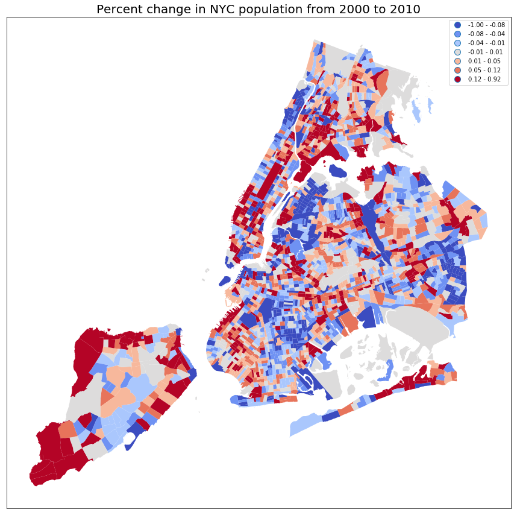

# Peer Review for Kent Pan (kwp225)

## Reviewer: Baoling Zhou (bz882)

## Comments

### Clarity

-   The plot seems confusing at the first sight but the title and the legend helps explain the meaning of the map.
 

[Suggestion]

-   It seems like that NYC has been divided by census tract but the title did not specify this. 
-   Plus, the legend did not specify the unit. 0.01 can mean either 1% or 0.01%. It will be great if the author can put this information somewhere on the graph. 
-   Also, there must be a better way to define the color subset. For example, it will be more meaningful if the author can let grey color subset represent the mean of the percentage change in NYC population as a whole.

### Aesthetic

-   The red-grey-blue color combination is easy to recognize. It is easy to refer to the legend to look up which subgroup each polygons belongs to.

[Suggestions]

-   The title and legend can be made bigger. 
-   It might be more appropriate to use neighborhood (eg. Bay Ridge) as the unit of analysis. Census Tract is too small, which makes the whole graph distracting. Also, analyzing population change in neighborhoods over time could make more sense as each of them have its own unique characteristics.

### Honesty

-   Good point to point out the misleading data regarding Central Park and Greenwood Cemetery. Theoretically, there should be no population change in those residential areas.

[Suggestions]

-   Even though there are census records in those places, I would suggest to use white color to phase out the corresponding polygons, since they are not relevant in a residential analysis.