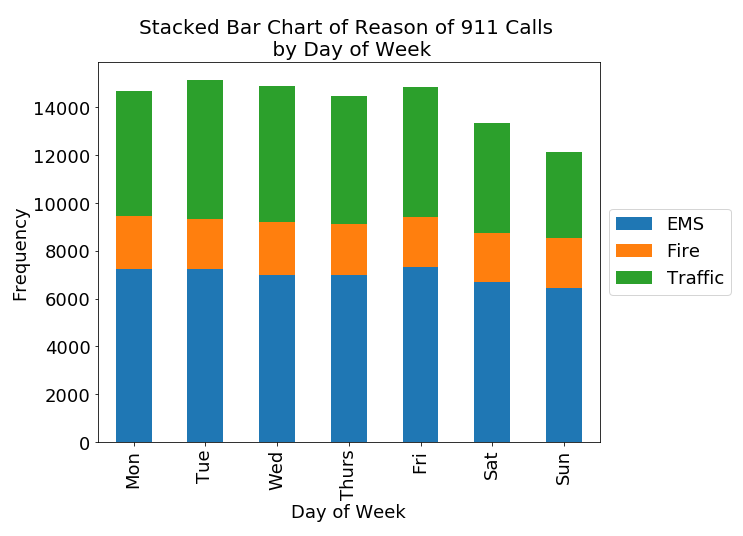

Reviewer: Kent (kwp225)

The plot is easy to read and clearly shows an overall trend in the data, and the quantities and units are clear and unambiguous. The title should mention the location where the data is taken from, since it provides valuable context for the viewer. An additional trend line on top of the bars could have been helpful to visually show the trend. 

Colors are appropriate, but I would suggest that the font size on the x- and y-ticks be decreased since they seem overly large. I would also remove the “Stacked Bar Chart” part of the title, since the viewer already sees what kind of chart it is. 

The plot is honestly reproducing the data with no distortion, but I’m not sure if the stacked bar chart format is the best format for showing the data, since it doesn’t make the quantities within each of the three categories clear - a series of bars would have been better for that. Depending on values in the data and the message that the plot is trying to convey, I think either the stacked bar (for overall trend) or series of bars (for comparing within the categories) could have been appropriate. 
