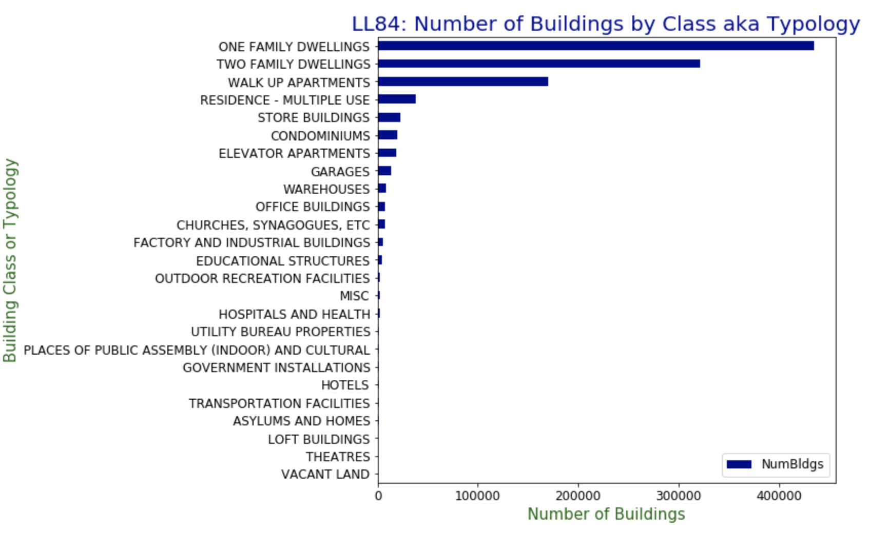

Reviewer: Kent (kwp225)

The plot is clear and easy to read, with clear quantities and units being shown. It would have been helpful to have gridlines and/or subticks to help the viewer approximate the counts for each category better. It would also be clear to explicitly state in the title that the data is for NYC buildings.

Color choice and unit labels are fine, but I would have changed the label of the category with the very long name (“Places of Public Assembly…”) so that there’s less wasted space. The legend in the bottom right corner is also unnecessary. 

The plot is honestly reproducing the data with no distortion to convey the message. However, since so many of the categories have tiny counts compared to the top few categories, it might be a good idea to group everything under a certain frequency into an “other” category. This would still preserve the message that the vast majority of buildings fall under the top few categories.

