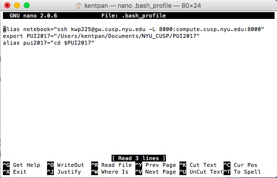
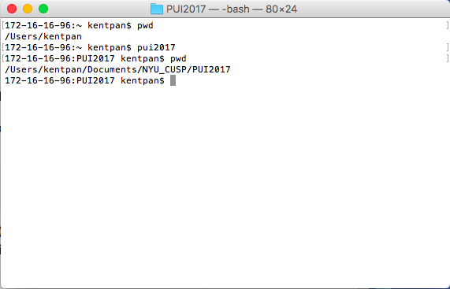

# PUI HW 1 Assignment 2

To set up the environment on my local computer, I first created a directory called PUI2017 within my Documents folder.

I opened the .bash_profile and set up the PUI2017 environmental variable using the command:
```
export PUI2017=“/Users/kentpan/Documents/NYU_CUSP/PUI2017
```

Then, I set up an alias pui2017 using the cd command and the $PUI2017 environmental variable:
```
alias pui2017=“cd $PUI2017”
```
These two steps cut out much of the repetitive typing that would be necessary to enter our working directory.

Screenshots showing the commands are below:



A new GitHub repo was then created and linked with the local repo on my computer, and the two will be kept in sync.